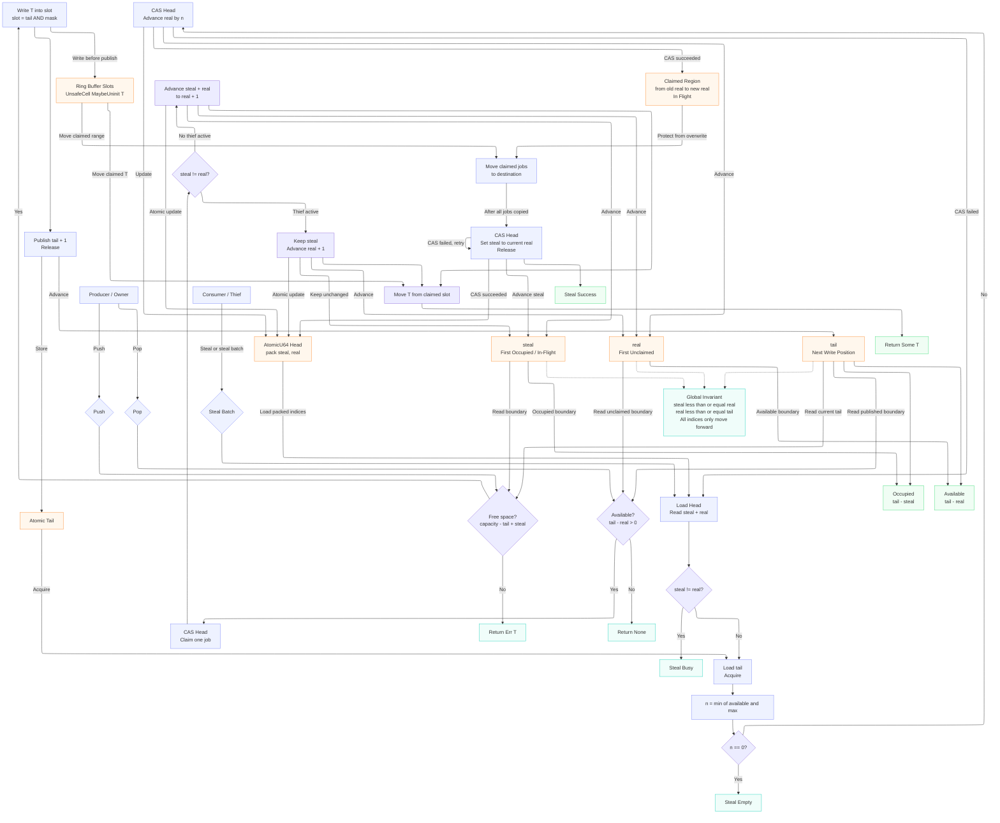

# Ring Buffer

## Overview

**The Thread Pool Challenge** 

When building a thread pool, the primary hurdle I encountered was managing concurrent access to a shared buffer. In the context of my ECS (Entity Component System) implementation, this buffer stores a large volume of jobs that the system needs to process.

Processing these jobs sequentially on a single thread is inefficient and creates a bottleneck. To improve performance, I need multiple threads to consume these jobs in parallel. However, this introduces a classic synchronization problem.

**The Concurrency Bottleneck**

The system architecture involves two distinct types of operations occurring simultaneously:
* **Producer:** The main thread pushes new jobs into the buffer as they are generated.
* **Consumers:** Multiple worker threads pull jobs from the buffer to execute them.

Because these threads operate in parallel, data contention is inevitable. If I rely on standard synchronization primitives like `Mutex` or `RwLock`, the overhead becomes significant. Frequent locking forces threads to wait, which increases latency and extends the time required to complete a single frame.

To maintain high performance, the goal is to minimize contention between threads as much as possible. A ring buffer is the ideal data structure for this scenario. By using a ring buffer, I can decouple the production and consumption of jobs, allowing for a more efficient, lock-free approach that keeps the engine running smoothly.

## Cấu trúc dữ liệu

## Flow chart 💀

## References
- https://en.wikipedia.org/wiki/Circular_buffer
