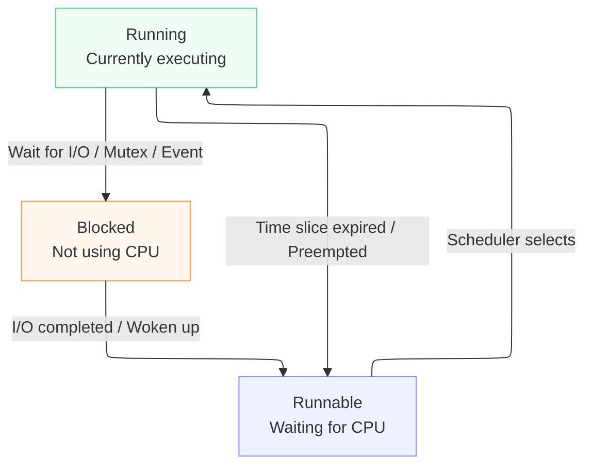
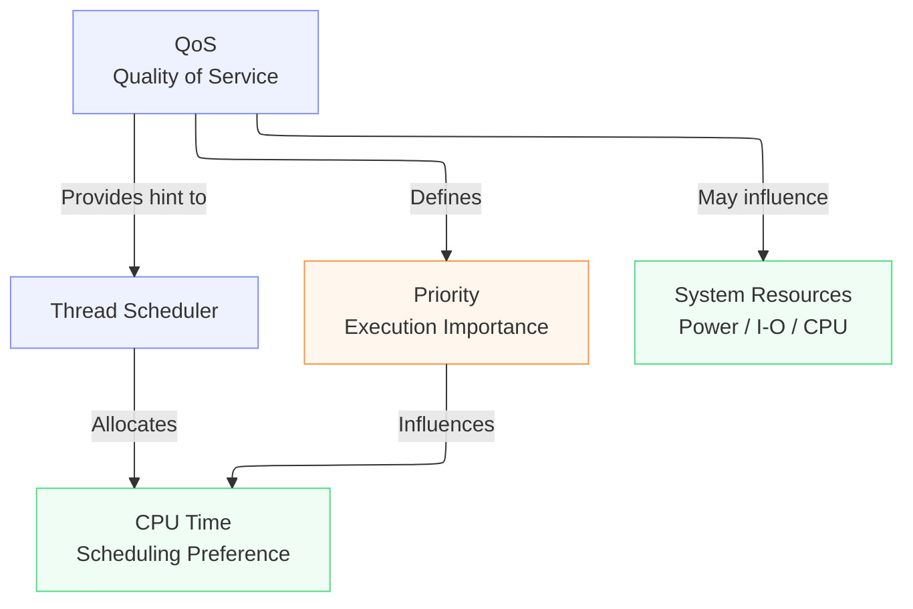

## Overview

A game engine must manage a variety of concurrent tasks to maintain performance:

- Calculating physics, animations, and culling to meet the current frame deadline.
- Loading textures or scene data from disk.
- Compiling shaders, decompressing data, and preparing assets.
- Handling background OS applications outside the engine.

These tasks compete for CPU resources, but they do not share the same level of urgency. At 60 FPS, the engine has approximately `16.67 ms` to complete a frame. While a slight delay in loading a texture is often imperceptible, missing a frame deadline leads to immediate stuttering and a poor user experience.

## Managing Thread Priority

To address this, I created `src/apis/priority.rs`. This module provides an enum that allows the engine to communicate its scheduling requirements to the operating system:

- **High-priority threads:** These handle frame-critical tasks and require low-latency access to the CPU.
- **Low-priority threads:** These handle I/O or background tasks, allowing them to yield CPU resources or utilize power-efficient cores instead.


## Prerequisites

### Processes, threads, and cores

A **process** is a program currently in execution, such as the Xynok Engine. A single process can contain multiple **threads**. Each thread acts as an independent stream of execution: the main thread might handle the windowing system while worker threads manage physics calculations or file I/O.

A **CPU core** is the actual hardware resource that executes instructions. Often, there are more threads waiting to run than there are available cores. The existence of a thread does not guarantee that it is actively running on a core.

Modern CPUs may also feature two distinct types of cores:

- Performance cores (P-cores): faster, but higher power consumption.
- Efficiency cores (E-cores): slower, but more power-efficient.

### The OS Scheduler

The operating system scheduler is responsible for making constant decisions about thread management. Its primary duties include:

1. Determining which thread executes at any given moment.
2. Deciding which threads must remain in a waiting state.
3. Assigning threads to specific CPU cores.
4. Calculating the time slice (or quantum) a thread is permitted to run before it must yield to another process.

At a high level, the lifecycle of a thread transitions through several states managed by this scheduler.



### QoS (Quality of Service)



**Quality of Service**, usually abbreviated as **QoS**, is metadata that describes the nature and urgency of work to the operating system. It gives the scheduler more context than simply saying that one thread has a higher numeric priority than another.

For example, the scheduler benefits from knowing whether a thread is:

- producing the frame or animation currently visible to the user;
- completing an operation the user explicitly requested;
- performing a long-running task that can make gradual progress;
- carrying out maintenance work that is not immediately visible.

The OS can use this information when deciding:

- how quickly a runnable thread should receive CPU time;
- how readily another thread may preempt it;
- whether to prefer a P-core or an E-core on heterogeneous CPUs;
- how aggressively the CPU should trade performance for power efficiency.

QoS is therefore broader than traditional thread priority. Priority primarily influences competition for CPU time, while QoS can also influence core selection and power-management policy.

Apple platforms expose the idea directly through QoS classes. From most urgent to least urgent, the commonly used classes are:

| QoS class | Intended work | Example |
|---|---|---|
| `USER_INTERACTIVE` | Work that must finish immediately to maintain a responsive interface | rendering the current frame or updating an animation |
| `USER_INITIATED` | Work started by the user whose result they are waiting for | opening a document or loading a selected level |
| `UTILITY` | Longer-running work that should continue making progress | downloads, imports, and asset processing |
| `BACKGROUND` | Maintenance invisible to the user | cleanup, indexing, or speculative preloading |

Xynok currently needs only two scheduling intents: frame-critical and low-priority work. It maps `Frame` to `USER_INTERACTIVE`, while both `Background` and `Io` map to `UTILITY` on Apple platforms. Other operating systems have no direct equivalent of QoS classes and reach for the same intent through different APIs, described in [What each platform actually does](#what-each-platform-actually-does).

> QoS is an input to the scheduler, not a reservation. The scheduler still weighs system load, temperature, battery state, and process permissions before it decides anything.

### Why I/O work asks for a lower class

A thread waiting on a disk read is not burning CPU, but it is still a thread the scheduler has to place somewhere, and on a machine with mixed cores it may sit on one of the fast ones. Telling the OS that this work is not urgent lets it park the thread somewhere cheap. The wait is dominated by the device rather than by instructions, so running on a slower core costs almost nothing and saves a noticeable amount of power.

That is the reason the Blocking lane exists and why it defaults to `Priority::Io`. The goal is not to finish the read sooner, it is to keep the read out of the way of the frame.

## [`Priority` Data Structure](../src/apis/priority.rs)

`Priority` helps the OS scheduler determine which threads should take precedence when multiple threads compete for execution time.

```rust
pub enum Priority 
{
    Frame,
    Background,
    Io,
}
```

| Value | Intended Use | Goal |
|---|---|---|
| `Frame` | ECS, physics, animation, culling, render preparation | Minimize frame latency |
| `Background` | Tasks not on the critical frame path | Yield resources for user interaction |
| `Io` | File I/O, streaming assets, syscall-bound tasks | Reduce CPU contention, improve power efficiency |

`Frame` is the default value. Internally there are only two levels: `Frame` becomes `Interactive`, while `Background` and `Io` both become `Low`.

Which means `Background` and `Io` behave identically today. They stay separate because they describe different situations, one is work off the frame path and the other is work waiting on a device, and keeping them apart now lets a future backend treat them differently without anyone having to revisit a call site. Pick the variant that describes your job, not the one that describes the current mapping.

> This is **thread priority**, not individual job priority. Once a worker picks up a job, all tasks it executes inherit the scheduling characteristics of that worker. If a specific type of job must run on a different group of threads, the engine must dispatch it to the appropriate lane.

> [!IMPORTANT]
> `Priority` does NOT provide absolute guarantees that:
>
> - high-priority threads will always run first;
> - tasks will definitely finish by a specific deadline;
> - threads will reside on a specific core;
> - increasing priority will always make the entire application faster.
>
> The scheduler also considers system load, thermal state, power constraints, process permissions, and platform-specific policies. Setting priorities too high or incorrectly can starve the UI, audio, or the entire system of CPU time.

### What each platform actually does

The three platforms share no common API here, and not one of them lets a thread set someone else's priority. Everything below applies to the **calling** thread, which is exactly why the call lives inside the worker.

| Platform | API | Notes |
|---|---|---|
| macOS, iOS | `pthread_set_qos_class_self_np` | The only platform whose scheduler genuinely reads this. On Apple silicon it is also what steers a thread toward a P-core or an E-core. |
| Linux, Android, BSD | `nice` | Acts on the calling task, since a thread on Linux is a task. |
| Windows | `SetThreadPriority` plus `THREAD_POWER_THROTTLING` | The second call is the one that switches EcoQoS on or off, which is what nudges a thread toward the power-efficient cores. |
| Anything else | nothing | The module compiles down to an empty function. |

Two behaviors are worth knowing before you read too much into a profile:

- **On Linux, `Frame` does nothing at all.** Lowering a nice value needs `CAP_SYS_NICE`, which a game normally does not have, so the module does not even attempt it. Only the low level calls `nice(10)`. Frame threads keep the default priority and I/O threads step aside, which is the half of the arrangement that actually works without privileges.
- **On Windows, frame threads switch EcoQoS off on purpose.** Leave it on and the OS is free to migrate the whole pool onto the efficiency cores, and a 16 ms frame budget does not survive that.

Under Miri the entire thing is skipped, since these are FFI calls Miri cannot execute.

## From Lanes to the Operating System

When you build a `Lanes` (a set of thread pools), each lane configures itself from its own default priority. Every worker in that pool then carries the same execution policy, whatever individual jobs it happens to pick up.

On a machine with mixed cores, what this buys you is a tendency rather than a placement:

- Compute workers ask for the interactive class, so the scheduler tends to keep them on P-cores and away from aggressive throttling.
- Blocking workers ask for the low class, so the scheduler is free to park them on E-cores. That suits them, because their time goes into syscalls anyway.

Neither of those is pinning. The engine never calls an affinity API, and the OS remains free to move any of these threads wherever it wants, whenever it wants.

The setting belongs to the lane as a whole, not to individual jobs. Workers stealing from one another or handling wildly different work still carry the priority profile chosen at initialization.

### Why must the worker set its own priority?

The APIs used by this module affect the **calling thread**. Consequently, the following logic must execute within the worker itself:

```rust
fn worker_loop(shared: Arc<Shared>, index: usize) {
    // The `current thread` here is the worker itself.
    shared.priority.apply_to_current_thread();

    // Start the loop to find and run jobs...
}
```

If you call `apply_to_current_thread()` inside `ThreadPool::new` before spawning, the code would modify the priority of the thread creating the pool, which is usually the main thread, rather than the workers being created.

## Usage

In most cases, you do not need to call `apply_to_current_thread()` directly. Simply configure the pool:

```rust
use xynok_concurrency::apis::priority::Priority;
use xynok_concurrency::pool::{Config, ThreadPool};

let pool = ThreadPool::new(Config {
    threads: 2,
    thread_name: "asset-loader".to_string(),
    priority: Priority::Io,
    ..Config::default()
});
```

Every worker spawned by this pool will set its priority on startup.

Note the explicit `threads`. `Config::default()` sizes a pool for compute work, one worker per core minus one, which is far more threads than an asset loader ever wants.

With the default lane system, the configuration is already predefined:

```rust
use xynok_concurrency::lanes::{LaneId, Lanes, LanesConfig};

let lanes = Lanes::new(LanesConfig::default());

// Runs on compute workers with Priority::Frame.
lanes.spawn(LaneId::Compute, || {
    // physics, animation, culling...
});

// Runs on blocking workers with Priority::Io.
lanes.spawn(LaneId::Blocking, || {
    let _ = std::fs::read("scene.pak");
});
```

## Limitations and Common Misconceptions

### OS rejections are not errors

Native APIs can fail for various reasons, such as insufficient permissions or running on an older OS version. The module intentionally ignores these errors, treating priority as a **best effort** optimization. Failure to set priority is not a reason to prevent the game from launching.

This means `apply_to_current_thread()` does not return a `Result`, and callers cannot verify whether the scheduler has accepted the request.

### Main/host threads are not modified

`ThreadPool` allows the thread that created the pool to participate in running jobs, but the priority-setting call is restricted to the `worker_loop` of spawned threads. The main/host thread retains the priority assigned by the application or the OS.

If `threads: 0` is configured, the pool spawns no workers and all jobs run inline on the caller. In this case, no worker will call the priority module.

### Priority cannot fix jobs in the wrong lane

A heavy CPU-bound job sent to the Blocking lane will still run at a low priority and may experience significant delays. Similarly, a synchronous file read sent to the Compute lane may still block the compute worker. Priority only fine-tunes the scheduler, it does not replace the need to categorize jobs correctly.

Practical rules:

- CPU-bound tasks that must finish within one frame: Compute;
- Tasks primarily waiting on syscalls or non-urgent work: Blocking;
- Tasks strictly requiring the main thread: Main;
- Real-time callbacks (e.g., audio): Use a dedicated thread with a custom design, not this pool.

### More threads does not mean faster execution

Priority does not create more cores. If you spawn too many workers, they will still compete for time slices, causing constant cache thrashing and increased context switching overhead. This is why the Compute lane spawns one worker per core minus one, with the calling thread making up the difference, while the Blocking lane stays fixed at two to four workers no matter how large the machine is. On a machine with few cores the two lanes end up about the same size, and that is fine: the blocking count is chosen for how many parallel reads a disk handles well, not for how many cores you happen to have.

## Summary

`src/apis/priority.rs` serves three main purposes:

1. providing a common language consisting of `Frame`, `Background`, and `Io`;
2. translating those intentions into QoS, nice values, Windows thread priorities, or EcoQoS;
3. applying the settings from within each worker without creating hard dependencies on a specific OS.

It is a thin policy layer that connects two vital parts of the engine: the lane structure at the application level and the scheduler at the operating system level. The objective is not to make every job run as fast as possible, but to ensure that **the right work is prioritized at the right time**, particularly for tasks on the critical frame path.

## Related Documentation

- [`src/apis/priority.rs`](../src/apis/priority.rs): Platform-specific implementation.
- [`src/pool/mod.rs`](../src/pool/mod.rs): Storage for configuration and worker priority application.
- [`src/lanes.rs`](../src/lanes.rs): Default priority selection for Compute and Blocking lanes.
- [`docs/lane_queue.md`](lane_queue.md): How jobs are dispatched to and moved between lane workers.

External reading:

- [Process schedulers in an operating system](https://www.geeksforgeeks.org/operating-systems/process-schedulers-in-operating-system/): the basics, if scheduler states are new to you.
- [Prioritize work at the task level](https://developer.apple.com/library/archive/documentation/Performance/Conceptual/power_efficiency_guidelines_osx/PrioritizeWorkAtTheTaskLevel.html): Apple's reasoning behind QoS classes.
- [`setpriority(2)`](https://www.man7.org/linux/man-pages/man2/setpriority.2.html): what `nice` actually changes on Linux.
- [Introducing EcoQoS](https://devblogs.microsoft.com/performance-diagnostics/introducing-ecoqos/): what `THREAD_POWER_THROTTLING` switches on.
